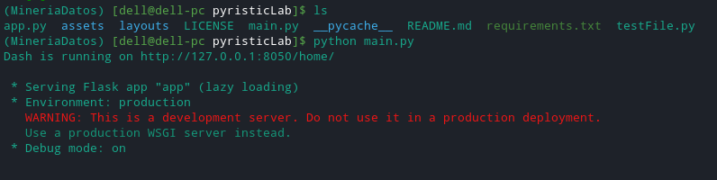
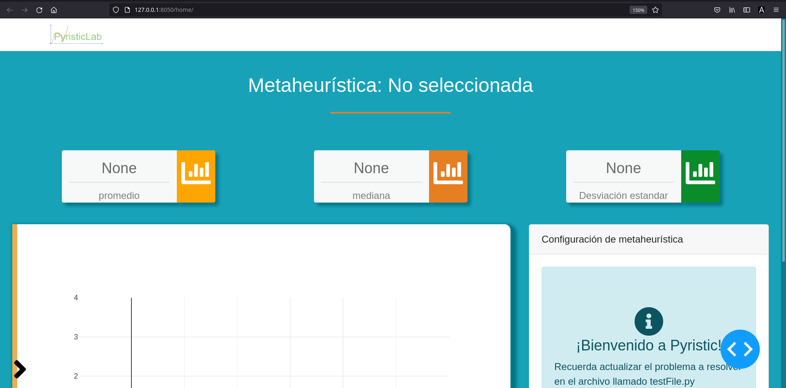
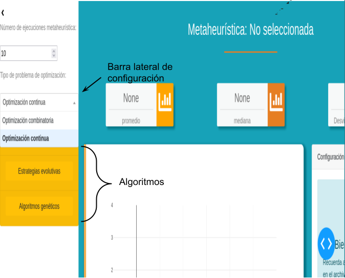
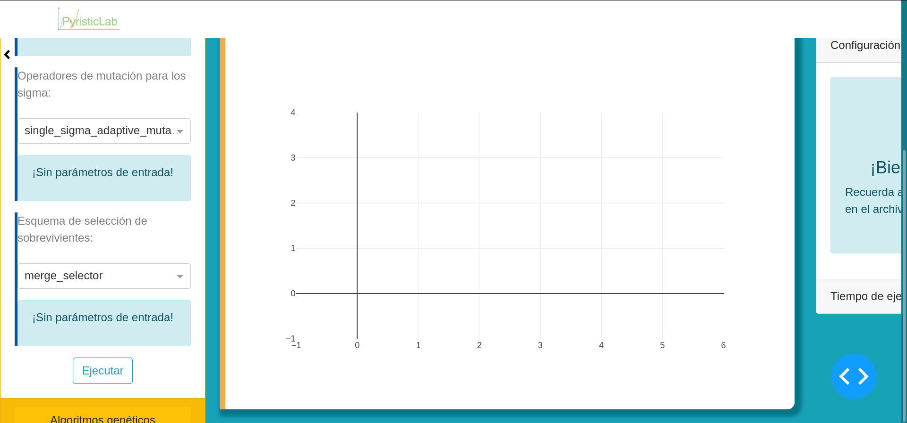

# PyristicLab
Es una aplicación web de código abierto que facilita el uso de la librería  *pyristic*, donde, nos permite obtener estadísticas relevantes de manera ágil sobre el problema a resolver con solo implementar la función objetivo.

## Instalación
Antes de proceder a examinar *pyristicLab* es necesario resolver la compatibilidad de dependencias. 

La versión aceptada de las dependencias son:
!!! warning ""
    1. pyristic (La versión más reciente)
    2. dash>=1.20.0
    3. dash-bootstrap-components>=0.11.1


!!! note "El proceso de instalación es el siguiente:"

    * Descargamos el proyecto:
        ```console
            $ git clone https://github.com/JAOP1/pyristicLab.git
        ```
    * Creamos un entorno de conda para asegurarnos que no haya problemas de compatibilidad entre librerias de python (opcional).
        ```console
            $ conda create --name pyristic-env
        ```
    * Instalamos pyristic.
        ```console
            $ pip install pyristic 
        ```
    * Instalamos Dash.
        ```console
            $ pip install dash
        ```
    * Instalamos dash-bootstrap
        ```console
            $ pip install dash-bootstrap-components
        ```

    Si todo salió correctamente, podemos ejecutar el siguiente comando dentro del directorio de pyristicLab.
        ```console
        [user@pyristicLab/]$ python main.py
        ```

Finalmente, debemos ver el siguiente mensaje en consola:



Al abrir nuestro navegador, colocamos la url indicada en la consola (http://127.0.0.1:8050/home/) y nos mostrará la interfaz gráfica. 



## Modo de uso
Antes de comenzar, es necesario definir el problema a resolver en el archivo **testFile.py** (por defecto tiene la función de Ackley).  En este archivo, se tiene las siguientes variables reservadas: 
!!! warning ""
    * **optimizationProblem**: Almacena un diccionario que tiene las siguientes llaves:
        - *function*: la función objetivo.
        - *constraints*: arreglo que contiene funciones booleanas que evalúan las soluciones.
        - *bounds*: Arreglo con los límites para cada una de las variables de decisión.
        - *decision\_variables*: El número de variables de decisión del problema a optimizar.
    * **aptitudeFunction**: En el caso de emplear algoritmos genéticos, es necesario implementar una función de aptitud (se emplea en la selección de padres). 




En la esquina inferior izquierda de la pantalla principal de pyristicLab, se encuentra una flecha. Al dar clic se desplegará el menú de configuración. Los algoritmos que cuenta pyristic actualmente se clasifican para resolver problemas de optimización continua y combinatorios. Al seleccionar el tipo de problema a resolver, se desplegará un listado de algoritmos disponibles.




Al seleccionar alguno de los algoritmos, introducimos la configuración deseada y posteriormente, damos clic en *Ejecutar*. Los resultados obtenidos tras haber ejecutado el algoritmo un número de ejecuciones son: el promedio, la mediana, la desviación estándar y el tiempo de una ejecución. 
